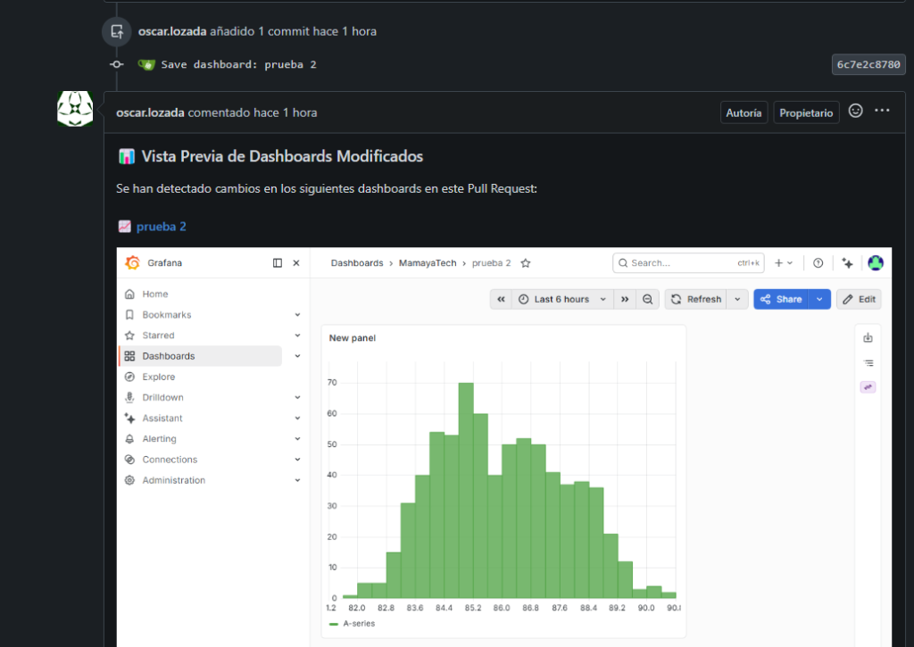

# Visual Pull Request Previews for Grafana

This service enables visual Pull Request / Merge Request previews on self-hosted Git platforms (such as Gitea, GitLab, Forgejo, or Gogs) by posting rendered dashboard screenshots as comments when dashboard JSON files are modified.

## How It Works
1. A developer creates or updates a Pull Request / Merge Request containing Grafana dashboard JSON files under a tracked directory (e.g., `Dashboards/`).
2. The Git server triggers a webhook to our Flask receiver.
3. The Flask service immediately acknowledges the webhook with `202 Accepted` to prevent server timeouts.
4. In a background thread, Flask:
   - Queries the Git server API to find modified JSON dashboard files.
   - Downloads the modified dashboard JSON files and extracts their `uid` and `title`.
   - Calls the local **Grafana Image Renderer** service to capture a PNG screenshot of the dashboard.
   - Stores the preview PNG in a local static directory exposed by Flask.
   - Posts a markdown comment containing the preview image back to the Pull Request / Merge Request.

---

## Example Preview

Below is a screenshot of the actual visual preview comment posted automatically by the webhook when a dashboard JSON is modified in a Pull Request:



---

## Prerequisites
- **Python 3.12+** with `flask` and `requests` packages (or **Docker**).
- **Grafana Image Renderer** service running locally (usually port `8081` via PM2, Docker, or Node.js).
- An SSL Certificate (`.pem` and `.key`) since Git servers require webhooks to call secure HTTPS URLs by default.

---

## 1. Git Server Configuration

### For Gitea / Forgejo (`app.ini`)
By default, Gitea prevents webhooks from calling local network IP addresses or private IP ranges. 
On your Gitea server, locate your `app.ini` configuration file (usually in `custom/conf/app.ini`) and update the `[webhook]` section:

```ini
[webhook]
ALLOWED_HOST_LIST = loopback, private, YOUR_FLASK_SERVER_DOMAIN_OR_IP
SKIP_TLS_VERIFY = true
```

*Note: `SKIP_TLS_VERIFY = true` is required if your Flask application uses a self-signed certificate or an internal Certificate Authority.*

Restart the Gitea service after editing `app.ini`.

---

## 2. Flask Webhook Script Setup

1. Copy `flask_webhook.py` to your target directory on the server.
2. Open `flask_webhook.py` and customize the placeholder values in the configuration section:

```python
GITEA_API_URL = "https://YOUR_GITEA_SERVER:PORT/api/v1"
GITEA_TOKEN = "YOUR_GITEA_PERSONAL_ACCESS_TOKEN"
GRAFANA_SA_TOKEN = "YOUR_GRAFANA_SERVICE_ACCOUNT_TOKEN"
GRAFANA_URL = "https://YOUR_GRAFANA_SERVER:PORT"
PREVIEWS_DIR = r"/app/static/previews" # Adjust according to OS (Windows/Linux)
```

---

## 3. Deployment Options

### Option A: Docker Deployment (Recommended, Platform-Agnostic)

Deploy using the provided `Dockerfile` and `docker-compose.yml`. This works on Linux, macOS, and Windows.

1. Build and start the container in the background:
   ```bash
   docker-compose up --build -d
   ```
2. Your service will be running on port `5000` with the `previews` directory mapped as a persistent volume.

---

### Option B: Linux Deployment (Production Standard via systemd)

For running natively on Linux (Ubuntu/Debian/CentOS):

1. Install dependencies:
   ```bash
   pip install -r requirements.txt
   ```
2. Install a production WSGI server like **Gunicorn**:
   ```bash
   pip install gunicorn
   ```
3. Create a systemd service file at `/etc/systemd/system/grafana-pr-preview.service`:
   ```ini
   [Unit]
   Description=Grafana PR Preview Service
   After=network.target

   [Service]
   User=www-data
   WorkingDirectory=/opt/visual-pr-previews-grafana
   ExecStart=/usr/local/bin/gunicorn --workers 3 --bind 0.0.0.0:5000 --keyfile certs/private.key --certfile certs/certificate.pem flask_webhook:app
   Restart=always

   [Install]
   WantedBy=multi-user.target
   ```
4. Reload systemd, enable and start the service:
   ```bash
   sudo systemctl daemon-reload
   sudo systemctl enable grafana-pr-preview
   sudo systemctl start grafana-pr-preview
   ```

---

### Option C: Windows Deployment (using NSSM)

For running natively on a Windows Server:

Open an Administrator command prompt and execute:

```cmd
:: Create the service
nssm install FlaskAPIService "C:\path\to\python.exe" "-u D:\api_flask_webhook\flask_webhook.py"

:: Set the startup directory
nssm set FlaskAPIService AppDirectory "D:\api_flask_webhook"

:: Configure stdout and stderr logs
nssm set FlaskAPIService AppStdout "D:\api_flask_webhook\nssm_out.log"
nssm set FlaskAPIService AppStderr "D:\api_flask_webhook\nssm_err.log"

:: Start the service
net start FlaskAPIService
```

---

## 4. Other Git Platforms (GitLab, Forgejo, Gogs)

- **Forgejo & Gogs**: Share the identical API schema as Gitea. No code modifications are needed.
- **GitLab (Self-Hosted)**:
  To adapt this service for GitLab, change the REST API requests in `flask_webhook.py`:
  - Fetch modified files: `GET /api/v4/projects/{id}/repository/commits/{sha}/diff`
  - Post PR comment: `POST /api/v4/projects/{id}/merge_requests/{merge_request_iid}/notes`
  - The webhook event type header is `X-Gitlab-Event` instead of `X-Gitea-Event`.

---

## 5. Local Testing

To test the receiver locally without triggering a webhook:
1. Open `test_trigger.py` and fill in the placeholders (`YOUR_COMMIT_SHA`, `YOUR_REPO_NAME`, etc.).
2. Execute the script:
   ```bash
   python test_trigger.py
   ```

---

## License & Disclaimer

This project is licensed under the [MIT License](LICENSE).

### Trademarks

Grafana® and Grafana Labs® are registered trademarks of Grafana Labs. This project is an independent, community-developed integration and is not affiliated with, endorsed, sponsored, or officially supported by Grafana Labs or its affiliates in any way.
